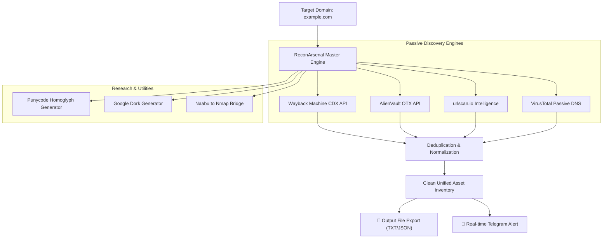

<p align="center">
  <h1 align="center">🛡️ ReconArsenal</h1>
</p>

<p align="center">
  <b>Unified OSINT, Asset Discovery & Passive Reconnaissance Arsenal</b>
</p>

<p align="center">
  <a href="https://github.com/pratik-khairnar-sec/recon-arsenal/releases"></a>
  <a href="https://github.com/pratik-khairnar-sec"></a>
  <a href="https://pratik-khairnar-sec.github.io/recon-arsenal/"></a>
  <a href="#-telegram-alerts"></a>
  <a href="LICENSE"></a>
</p>

<p align="center">
  <a href="https://pratik-khairnar-sec.github.io/recon-arsenal/"><b>🌐 Official Landing Page &amp; Live Demo</b></a> •
  <a href="#-features"><b>Features</b></a> •
  <a href="#-unified-cli-usage"><b>Unified CLI</b></a> •
  <a href="#-modular-engines"><b>Modular Engines</b></a> •
  <a href="#-telegram-alerts"><b>Telegram Alerts</b></a> •
  <a href="#-architecture"><b>Architecture</b></a>
</p>

---

## 📌 Overview

**ReconArsenal** is an all-in-one OSINT and attack-surface reconnaissance framework designed for bug bounty hunters, security analysts, and penetration testers.

Instead of running disjointed, ad-hoc shell commands, ReconArsenal combines multiple passive intelligence sources into a unified engine with **zero third-party dependencies** (built natively on the Python standard library) alongside battle-tested standalone scripts.

Every discovery pipeline supports **real-time Telegram push notifications**, automatic deduplication, multi-threaded querying, and standardized export options.

---

## ⚡ Key Capabilities

- **🚀 Unified Master CLI (`arsenal.py`)**: Run single modules or full automated chains in one shot.
- **📜 Wayback Machine CDX Crawler**: Multi-filter passive endpoint harvesting with extension and status-code filtering.
- **🌐 AlienVault OTX Harvester**: Automatic API pagination through historical indicator lists.
- **📡 urlscan.io Engine**: Passive subdomain and URL discovery across public scan records.
- **🦠 VirusTotal Passive DNS**: Resolution mapping and hostname tracking.
- **🔎 Google Dork Automation**: Instant query generator for sensitive files, cloud storage buckets, and admin panels.
- **🎯 Punycode & Homoglyph Generator**: IDN homograph spoofing research and lookalike domain detection.
- **⚡ Naabu → Nmap Deep Scan Bridge**: Converts raw port scans into threaded deep service audits with XML merging.
- **🤖 Built-in Telegram Dispatcher**: Native push alerts to your mobile device upon scan completion.
- **🔒 Zero Dependency Footprint**: Master CLI operates strictly on the native Python standard library.

---

## 🏗️ Architecture Pipeline



---

## 🚀 Quick Start & Installation

```bash
# Clone the repository
git clone https://github.com/pratik-khairnar-sec/recon-arsenal.git
cd recon-arsenal

# Make scripts executable
chmod +x *.sh *.py

# Run the interactive menu (zero pip install required!)
python3 arsenal.py
```

---

## 💻 Unified CLI Usage

### 1. Interactive Menu Mode
Simply run the script with no arguments to launch the interactive terminal interface:
```bash
python3 arsenal.py
```

### 2. Full Passive Reconnaissance Chain
Query all passive sources (Wayback + AlienVault + urlscan.io), deduplicate results, and save:
```bash
python3 arsenal.py -d example.com --all -o example_urls.txt --telegram
```

### 3. Individual Target Modules
```bash
# Query Wayback Machine only
python3 arsenal.py -d example.com --wayback -o wayback.txt

# Query AlienVault OTX only
python3 arsenal.py -d example.com --alienvault

# Generate Punycode Lookalikes
python3 arsenal.py -d example.com --punycode

# Generate Google Dorks
python3 arsenal.py -d example.com --dorks
```

---

## 🤖 Telegram Push Alerts

ReconArsenal can alert your Telegram bot when scans complete so you don't have to wait on long-running jobs.

### Setup in 10 Seconds:
Run the interactive wizard:
```bash
python3 arsenal.py --setup-telegram
```

Or configure environment variables in your `~/.bashrc`:
```bash
export TELEGRAM_BOT_TOKEN="123456789:AAxxxxxxxxxxxxxxxxxxxxxxxxx"
export TELEGRAM_CHAT_ID="123456789"
```

---

## 📦 Modular Scripts Directory

| Script | Language | Function |
|---|---|---|
| [`arsenal.py`](./arsenal.py) | Python 3 | Master Unified CLI & Interactive Menu |
| [`alienvault.sh`](./alienvault.sh) | Bash | AlienVault OTX URL Harvester with Pagination |
| [`wayback.sh`](./wayback.sh) | Bash | Wayback Machine CDX API Crawler |
| [`virustotal.sh`](./virustotal.sh) | Bash | VirusTotal Passive DNS & URL Resolver |
| [`urlscan.py`](./urlscan.py) | Python 3 | urlscan.io Subdomain & URL Extractor |
| [`dorking.py`](./dorking.py) | Python 3 | Google Dork Automation |
| [`naabutonmap.py`](./naabutonmap.py) | Python 3 | Naabu to Nmap Threaded Port Scanner Bridge |
| [`punycode_gen.py`](./punycode_gen.py) | Python 3 | Punycode IDN Homoglyph Attack Surface Tool |
| [`telegram_notify.py`](./telegram_notify.py) | Python 3 | Native Urllib Telegram Alert Dispatcher & Setup |
| [`lostfuzzer.sh`](./lostfuzzer.sh) | Bash | GAU → URO → httpx → Nuclei DAST Pipeline |

---

## 🛡️ Strict Legal & Educational Use Disclaimer

> [!CAUTION]
> **STRICTLY FOR EDUCATIONAL AND AUTHORIZED DEFENSIVE RESEARCH PURPOSES ONLY.**
>
> ReconArsenal is engineered exclusively to aid defensive security researchers, blue teams, system administrators, and bug bounty researchers operating under authorized scope and written permission.
>
> - **Passive Intelligence Only**: The default operational profile mines publicly archived, third-party internet telemetry (Wayback Machine, AlienVault OTX, VirusTotal, urlscan.io).
> - **No Active Exploitation**: ReconArsenal does not contain exploit payloads or invasive automated cracking tools.
> - **Compliance**: The user assumes complete responsibility for compliance with all applicable local, national, and international cybersecurity laws. The author (**Pratik Khairnar**) assumes zero liability for any misuse or illicit activity conducted using these tools.

---

## 👤 Author

**Pratik Khairnar**
- GitHub: [@pratik-khairnar-sec](https://github.com/pratik-khairnar-sec)
- Security Researcher & Open Source Reconnaissance Tools

---

## 📄 License

This project is licensed under the **MIT License** — see the [LICENSE](LICENSE) file for details.
